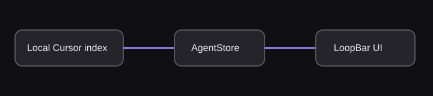

# LoopBar

LoopBar is a native macOS menu-bar monitor for recent local Cursor composers and Codex tasks. It displays a notch-style island at the top of the active screen and is deliberately read-only: it observes local application state, but never sends prompts or changes Cursor/Codex data.



## Run locally

Requirements: macOS 14+ and Xcode 15+.

```sh
swift run LoopBar
```

Click the island to expand it. Click an agent row to open its source application. The gear button opens settings; the refresh button performs an immediate refresh; the power button quits LoopBar.

## What the island shows

The panel is always centered over the active screen's notch area. Its background is fully black and opaque, with a custom shoulder shape at the top and rounded bottom corners. Compact and expanded modes share the same top header, so the island remains visually attached to the notch while its body changes below it.

### Compact / minimized mode

Compact mode is 370 points wide and 50 points high. It intentionally contains only the two actionable grouped counts:

- **Left side — running count:** counts every loaded agent whose status is exactly `running`.
- **Right side — attention count:** counts every loaded agent whose status has `needsAttention == true`: `waitingForApproval`, `waitingForInput`, `blocked`, or `failed`.

The compact header does not show elapsed time, task titles, source names, or completed counts. This keeps the minimized island small and readable around the notch. If there are no agents, it shows a centered waiting/connection badge instead.

The left running accent is source-aware:

- Codex running: blue
- Cursor running: purple
- Both sources running: blue is used as the shared compact accent

Green is reserved for completed agents in expanded rows. The right attention accent is status-aware: yellow for approval/input, orange for blocked, and red for failed. Large soft radial gradients begin at the island's upper-left and upper-right corners and use these same accents. The empty center remains clear around the notch.

The entire compact header is one click target, including the empty notch-safe space between the counters. Clicking anywhere in it toggles expanded mode.

### Expanded / maximized mode

Expanded mode is 520 points wide. The header remains visible at the top with the same running and attention counts, followed by the selected content body and a footer.

The agents body displays up to six rows: the three most recently updated Cursor composers plus the three most recently updated Codex threads. Rows are sorted globally by attention first, then running, queued, unknown, and terminal states; within a priority, the newest update appears first.

Each row contains:

- The task/composer title
- The source label (`Cursor` or `Codex`)
- A status label with elapsed time, such as `Running · 4m` or `Completed · 2m ago`
- The latest source-derived status text
- A progress bar when progress is available for a running agent
- A source/status color and icon

Expanded row colors are:

| Status | Cursor | Codex |
| --- | --- | --- |
| Running | Purple | Blue |
| Queued | Yellow | Yellow |
| Waiting for approval | Orange | Orange |
| Waiting for input | Cyan | Cyan |
| Blocked | Red | Red |
| Completed | Green | Green |
| Failed | Red | Red |
| Cancelled/unknown | Gray | Gray |

The expanded footer and Settings show the packaged app version from `CFBundleShortVersionString`. Direct SwiftPM development launches use the current development version as a fallback because they do not have an app Info.plist. The footer also provides refresh, settings, and quit controls. Settings and the placeholder logs content are selected through the expanded content state.

## Status model

`AgentStatus` supports `running`, `queued`, `waitingForApproval`, `waitingForInput`, `blocked`, `completed`, `failed`, `cancelled`, and `unknown`.

`needsAttention` is true only for approval, input, blocked, and failed states. A queued or merely old/unknown task is not counted in the compact right-side attention total.

Cursor Desktop status is inferred without hooks, in this order:

1. Explicit blocked state
2. Pending plan or blocking pending action → approval
3. Unread messages → waiting for input
4. Active generation, continuation, worktree application/creation/undo → running
5. Queue items → queued
6. Incrementally parsed transcript turn state → running, completed, or failed
7. An `aborted` follow-up with an advanced timestamp stays running until Cursor writes its terminal status
8. Other explicit status values
9. Completion subtitle (`Edited …`) → completed
10. Recent activity within the 15-second fallback window → running; otherwise unknown

macOS filesystem events watch Cursor's local database and project transcript directories. Writes are debounced briefly and trigger an immediate refresh, while the configured polling interval remains as a recovery pass. Transcript paths and read offsets are cached, so subsequent refreshes read only newly appended JSONL data. The Cursor process table is used only to prevent a closed desktop application from leaving a composer marked as running; shared Electron processes are never attributed to individual composers.

Codex status is inferred from the tail of each rollout JSONL file. Task completion, approval, input, blocked markers, tool calls, and newer activity are compared by their position in the rollout. If a stale approval or input marker is followed by newer reasoning, messages, tool calls, or tool output, the newer activity wins and the task is shown as running. This prevents old events from leaving an active Codex task stuck in a waiting state. Codex considers a thread active when its database update is within the 120-second active window.

Because neither local application exposes a complete durable run-state contract for every task, LoopBar preserves an `unknown` state when the available evidence is insufficient instead of guessing completion.

## Data flow and architecture

LoopBar uses a small MVVM-style split:

- `Sources/App/LoopBarApp.swift` — executable entry point; creates the store, view model, and panel controller.
- `Sources/App/AppDelegate.swift` — application lifecycle, notification delegate, and notification click handling.
- `Sources/Controllers/IslandPanelController.swift` — owns the borderless `NSPanel`, hosts SwiftUI, tracks screen changes, and resizes/repositions the panel. Width changes animate horizontally while vertical notch alignment remains fixed.
- `Sources/Geometry/IslandGeometry.swift` — calculates the active screen and notch-aligned panel frame.
- `Sources/ViewModels/IslandViewModel.swift` — owns compact/expanded chrome, selected content, and store-driven loading/error presentation. It does not own agent data.
- `Sources/Models/Agent.swift` — agent value model, sources, statuses, labels, icons, terminal state, and attention state.
- `Sources/Models/IslandState.swift` — compact, expanded, loading, and notification chrome states.
- `Sources/Models/IslandContent.swift` — agents, settings, and logs body selection.
- `Sources/Services/AgentStore.swift` — main-actor observable store, event-triggered and periodic refreshes, sorting, transient error handling, and status-transition notification triggers.
- `Sources/Services/CursorAPI.swift` — read-only SQLite access to Cursor's `composerHeaders` and related `cursorDiskKV` records.
- `Sources/Services/CursorFileWatcher.swift` — debounced macOS filesystem events for Cursor's state and transcript directories.
- `Sources/Services/CursorTranscriptMonitor.swift` — cached transcript discovery and incremental turn-state parsing.
- `Sources/Services/CursorActivityTracker.swift` — cross-refresh inference for Cursor's `aborted`-while-running follow-up lifecycle.
- `Sources/Services/CursorDesktopProcessDiscovery.swift` — application-level Cursor Desktop process guard.
- `Sources/Services/CursorHookCleanup.swift` — one-time removal of LoopBar's legacy hook without changing unrelated user hook commands.
- `Sources/Services/CodexAPI.swift` — read-only SQLite access to Codex's local `threads` table and rollout JSONL tails.
- `Sources/Services/AgentOpener.swift` — opens Cursor or Codex when a row or notification is clicked.
- `Sources/Services/NotificationService.swift` — posts status-transition notifications with sound in packaged `.app` builds and uses an `osascript` notification fallback for raw SwiftPM/debug runs.
- `Sources/Services/Settings.swift` — persists refresh interval and Cursor/Codex source toggles in `UserDefaults`.
- `Sources/Utilities/IslandMetrics.swift` — compact/expanded widths, heights, list sizing, and settings sizing.
- `Sources/Utilities/AgentElapsedText.swift` — elapsed-time formatting for expanded rows.
- `Sources/Views/IslandRootView.swift` — top-level SwiftUI sizing wrapper.
- `Sources/Views/MenuPanelView.swift` — black island shape, header/body/footer composition, dividers, and footer actions.
- `Sources/Views/CompactIslandView.swift` — grouped compact counts, directional gradients, and the full-width toggle hit area.
- `Sources/Views/ExpandedIslandView.swift` — agents list, settings body, logs placeholder, and error/empty states.
- `Sources/Views/AgentRowView.swift` — expanded agent row, elapsed status, source/status color, progress, and click action.
- `Sources/Views/SettingsView.swift` — source toggles and refresh interval controls.

The runtime flow is:

1. `AgentStore` starts Cursor file monitoring, a periodic recovery poll, and notification authorization.
2. Cursor filesystem changes trigger a debounced refresh; the recovery poll refreshes every enabled source.
3. Cursor and Codex records are normalized into `CursorAgent` values.
4. The store sorts the combined snapshot, compares statuses with the previous snapshot, and emits notifications for completed or newly actionable states.
5. SwiftUI observes the store and view model. Expanded content and panel height update when data, errors, or selected content change.

## Refresh and source settings

The refresh interval defaults to one second and is clamped between one and 60 seconds. Cursor file events can refresh sooner than this interval; the timer is a recovery mechanism and continues to drive Codex monitoring. Cursor and Codex monitoring can be enabled independently. A temporary SQLite read failure keeps the previous snapshot for that source instead of replacing it with a noisy empty/error state.

Each source is queried only when its setting is enabled. Cursor reads `~/Library/Application Support/Cursor/User/globalStorage/state.vscdb`; Codex reads `~/.codex/state_5.sqlite`. No API key, network connection, or external service is required.

## Notifications and opening tasks

Notifications are emitted only after the initial snapshot, and only when an agent changes into `completed` or into a state requiring attention. The notification includes the source, task title/status, and default sound. Clicking a Codex notification uses its `codex://threads/<id>` deep link. Cursor currently opens the associated workspace or Cursor fallback because Cursor does not expose a durable local deep link for a specific composer.

## Privacy

LoopBar reads local Cursor and Codex metadata only. It does not send prompts, edit files through either agent, modify their databases, or make network requests. On first launch after this version, it removes only LoopBar's legacy Cursor hook command, script, and event log while preserving unrelated hook commands.

## Build a distributable app

For signing, sandboxing, an application icon, and reliable UserNotifications behavior, move `Sources/` into an Xcode macOS App target. The package has no third-party dependencies.
