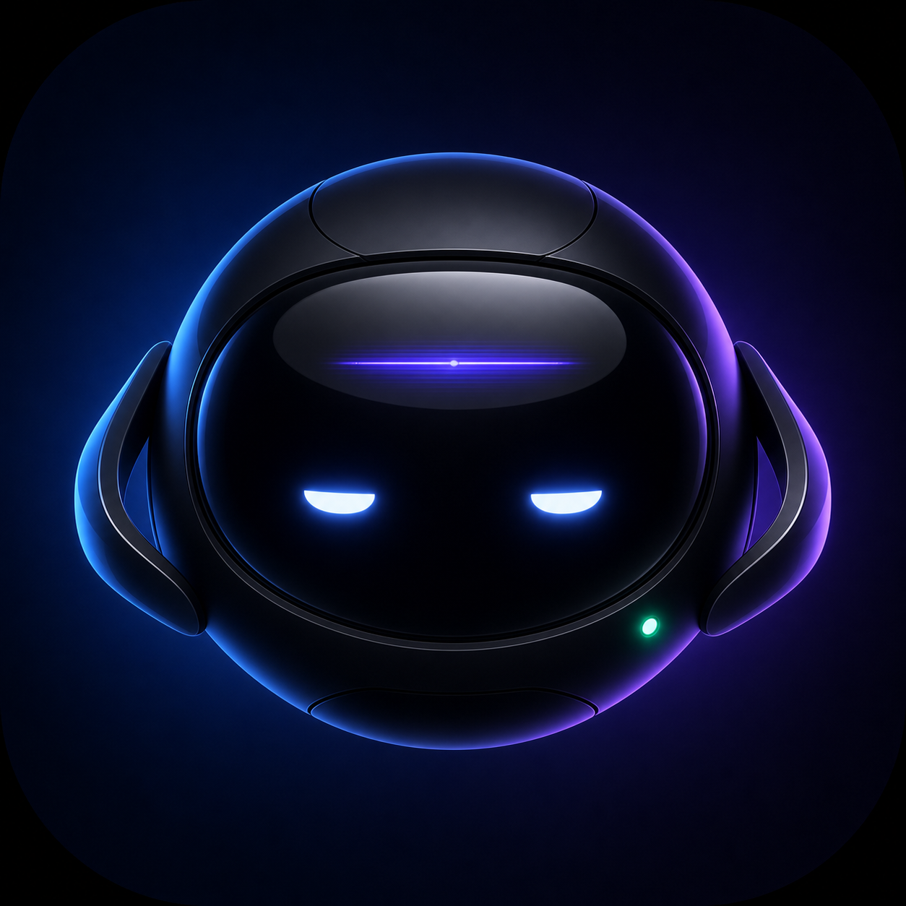
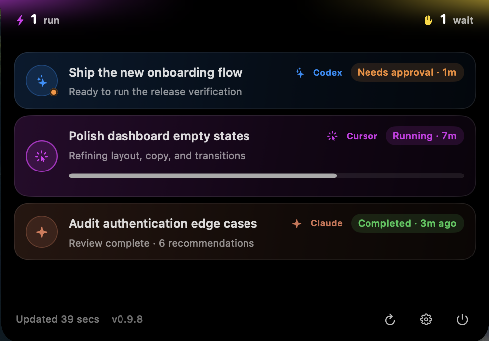
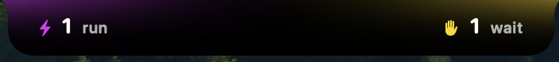
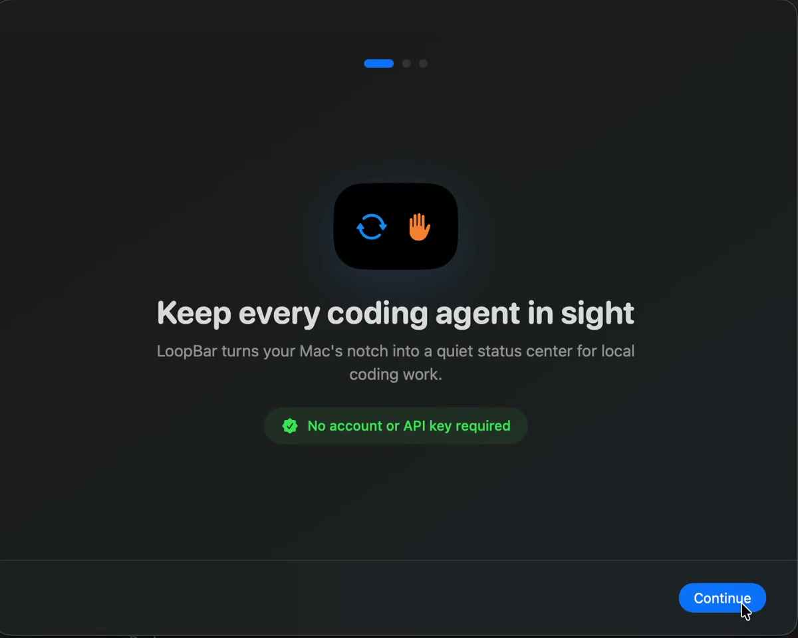
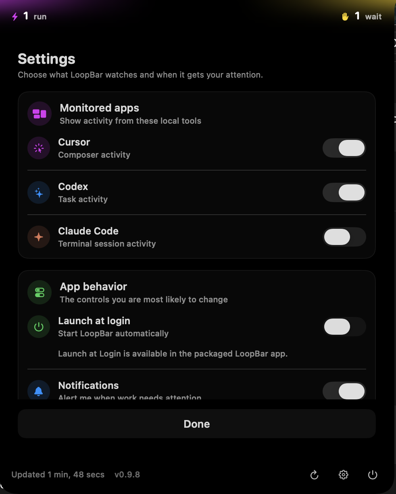

<p align="center">
  
</p>

<h1 align="center">LoopBar</h1>

<p align="center">
  <strong>Keep every coding agent in sight.</strong><br>
  A native macOS status island for Cursor, Codex, and Claude Code.
</p>

<p align="center">
  <a href="https://github.com/tohel17/LoopBar/releases/latest"><strong>Download LoopBar</strong></a>
  ·
  <a href="#how-it-works">How it works</a>
  ·
  <a href="#privacy-by-design">Privacy</a>
</p>

---

Your coding agents can keep working in different apps, windows, and terminals. LoopBar brings their most important signals to one glanceable place at the top of your screen—so you know what is running, what finished, and what needs you without constantly switching context.

LoopBar is local, read-only, and built for macOS. There is no account to create, no API key to configure, and no cloud dashboard between you and your work.

## See LoopBar in action

<p align="center">
  
</p>

<p align="center">
  Follow every agent in one view, with clear source colors, live status, elapsed time, progress, and attention signals.
</p>

### Quiet by default

<p align="center">
  
</p>

The compact island keeps only the two signals that matter most: what is running and what needs you.

### Set up in seconds

<p align="center">
  <a href="docs/media/loopbar-onboarding.mp4">
    
  </a>
</p>

<p align="center">
  <a href="docs/media/loopbar-onboarding.mp4"><strong>▶ Watch the 6-second onboarding walkthrough</strong></a>
</p>

<details>
  <summary><strong>See LoopBar settings</strong></summary>
  <br>
  <p align="center">
    
  </p>
</details>

## One glance. Every agent.

- **See what is working** — follow active Cursor composers, Codex tasks, and Claude Code sessions from one compact island.
- **Know when to step in** — spot approvals, questions, blocked work, and failures before they sit unnoticed.
- **Get notified at the right moments** — choose alerts for completed work, attention requests, and failures.
- **Jump back into the task** — select an agent to return to its source app or open the exact Codex task when available.
- **Stay out of the way** — the island collapses into a quiet running and attention count when you do not need the details.

## Designed for your Mac

LoopBar sits at the top of the active display and feels at home around the MacBook notch. Click it to reveal agent names, sources, live status, elapsed time, recent activity, and progress when available. Click away and it returns to its compact state.

Source-aware colors make the list easy to scan, while status colors keep the important moments unmistakable: running, queued, waiting for approval, waiting for input, blocked, completed, failed, or cancelled.

| Cursor | Codex | Claude Code |
| --- | --- | --- |
| Composer activity and related workspaces | App and CLI task activity with task deep links | Local terminal session activity |

## How it works

1. LoopBar reads recent task status from the supported tools already installed on your Mac.
2. The compact island shows how many agents are running and how many need attention.
3. Expand it for details, or use a notification to return to the work that needs you.

Everything is configurable: monitor only the tools you use, launch LoopBar at login, choose the refresh interval, and decide which notification types are useful to you.

## Privacy by design

LoopBar observes local application state without sending prompts, changing tasks, editing project files, or writing to your coding tools' databases.

- No LoopBar account
- No API keys
- Anonymous usage analytics for aggregate installation counts
- No prompts or project content uploaded by LoopBar
- Read-only access to local task metadata

Firebase records app opens and sessions, app and macOS versions, and basic device data. LoopBar also records an `app_active` event so aggregate active installations can be counted. It never sends prompts, project names, filenames, task details, or agent activity. LoopBar otherwise uses the network only for optional, signed app updates. Sparkle checks the public update feed and downloads releases from GitHub when updates are enabled.

## Install LoopBar

**Requires macOS 14 Sonoma or later.**

1. Download the newest DMG from [GitHub Releases](https://github.com/tohel17/LoopBar/releases/latest).
2. Open the DMG and drag **LoopBar** into **Applications**.
3. Launch LoopBar and follow the three-step setup.
4. Choose Cursor, Codex, and/or Claude Code, then optionally enable notifications and Launch at Login.

LoopBar includes secure in-app updates, with automatic daily checks and a manual **Check for Updates…** action in Settings.

## Controls

- Click the compact island to expand or collapse it.
- Click an agent row to return to its source application.
- Use the refresh button to check immediately.
- Use the gear button to change monitored tools, notifications, login behavior, updates, and refresh timing.
- Use the power button to quit LoopBar.

## Build from source

For local development, install Xcode 15 or later and run:

```sh
swift run LoopBar
```

`swift run` is ideal for development, but macOS cannot register the raw executable as a login item and Sparkle updates are disabled outside a packaged app.

To build a local app bundle and DMG:

```sh
bash scripts/build-dmg.sh
```

The script creates an ad-hoc signed build by default. To use a Developer ID identity:

```sh
CODE_SIGN_IDENTITY="Developer ID Application: Example (TEAMID)" bash scripts/build-dmg.sh
```

The app version lives in `Sources/Resources/version.txt`. Synchronize it with the packaged Info.plist before packaging:

```sh
./scripts/sync-version.sh
```

## Architecture

LoopBar uses a small MVVM-style design:

- `Sources/App` — app lifecycle and executable entry point
- `Sources/Controllers` — island and onboarding window management
- `Sources/Models` — normalized agent, source, and status values
- `Sources/Services` — read-only Cursor, Codex, and Claude Code monitoring; notifications; login items; and updates
- `Sources/ViewModels` — island presentation state
- `Sources/Views` — the SwiftUI island, agent rows, onboarding, and settings

Cursor monitoring combines local SQLite state, transcript activity, filesystem events, and a process guard. Codex combines its local threads database and rollout logs with process discovery where available. Claude Code combines local session transcripts, its live-session registry, and terminal process state. When the evidence is incomplete, LoopBar reports an unknown state instead of guessing.

For the Claude Code source design notes, see [`docs/claude-integration-architecture.md`](docs/claude-integration-architecture.md).

## Release a notarized build

After installing a Developer ID Application certificate, configuring a `notarytool` Keychain profile named `LoopBar`, and generating or importing the Sparkle signing key, run:

```sh
bash scripts/release.sh
```

The release script builds and signs the app, creates and signs the DMG, notarizes and staples it, runs Gatekeeper validation, writes a SHA-256 checksum, signs the update archive, and regenerates `appcast.xml` from `CHANGELOG.md`.

See [Sparkle's documentation](https://sparkle-project.org/documentation/) for update-key setup. Never commit the exported private key.

---

<p align="center">
  <strong>Spend less time checking agents. Spend more time shipping.</strong>
</p>
