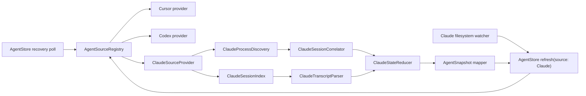

# Claude Code integration architecture

Status: proposed  
Scope: local, read-only Claude Code monitoring for LoopBar  
Reference implementation: [realfishsam/agent-notch](https://github.com/realfishsam/agent-notch)

## 1. Decision summary

Add Claude Code as a third local source through a source-provider boundary rather than wiring `ClaudeAPI` directly into `AgentStore`.

Claude session discovery must combine two independent signals:

1. **Process liveness** from terminal-attached `claude` processes.
2. **Session metadata and activity** from `~/.claude/projects/*/*.jsonl`.

This split is required because Claude Code normally appends to and closes its transcript file. Unlike Codex, the process cannot reliably be mapped to a transcript by looking for an open JSONL file descriptor. The primary correlation key is therefore the process working directory, encoded in the same form as Claude's project directory. TTY is used to deduplicate processes, not exposed as a stable session identity.

The first implementation remains zero-configuration and hook-free. Hooks are a possible later, opt-in precision upgrade, not part of this design.

## 2. Goals

- Show up to three recent top-level Claude Code sessions alongside Cursor and Codex.
- Preserve LoopBar's read-only, local-only privacy contract.
- Distinguish a live, actively conversing Claude process from a live but quiet process.
- Extract a useful user-authored title, model, project, and recent status text.
- Discover Claude Task subagents without displaying them as independent top-level rows.
- Avoid false completion notifications when process discovery fails for one poll.
- Keep Claude-specific filesystem and process rules outside the UI and `AgentStore`.
- Make future sources implement the same provider contract.

## 3. Non-goals

- Sending prompts, approving tools, or modifying Claude state.
- Installing or modifying Claude hooks.
- Monitoring headless/background Claude processes without a TTY.
- Reconstructing token usage, cost, or exact tool progress.
- Treating transcript modification time alone as proof that a process is alive.
- Deep-linking to an exact Claude terminal session in v1.
- Showing subagents in the existing flat `CursorAgent` UI in v1.

## 4. Source behavior and constraints

Claude's local data is organized under:

```text
~/.claude/projects/
  <encoded-project-path>/
    <session-id>.jsonl
    <session-id>/
      subagents/
        agent-*.jsonl
```

Important constraints:

- A top-level JSONL filename is the durable session identifier.
- The project directory represents an encoded working directory. Path encoding is an implementation detail and must be encapsulated in the correlator.
- A running Claude process may not hold the transcript open, so `lsof` is primarily used to obtain its current working directory.
- One terminal can have wrapper and child processes that both match `claude`; discovery must deduplicate by TTY and prefer the actual executable.
- Transcript writes are bursty. A process can be alive while its transcript is quiet.
- System housekeeping records can update a transcript without representing user/assistant activity.
- Subagent transcripts inherit parent liveness, but their own recent conversational write determines whether a subagent is busy.

## 5. Proposed component model



### 5.1 Shared source boundary

Introduce a source-neutral snapshot and provider protocol:

```swift
struct AgentSnapshot: Identifiable, Equatable, Sendable {
    let id: String
    let source: AgentSource
    let title: String
    let status: AgentStatus
    let activity: AgentActivity
    let detail: String
    let updatedAt: Date?
    let openTarget: AgentOpenTarget?
    let children: [AgentSnapshot]
}

protocol AgentSourceProvider: Sendable {
    var source: AgentSource { get }
    func fetchSnapshot(now: Date) async throws -> [AgentSnapshot]
}
```

`CursorAgent` should be renamed to `AgentSnapshot` (or temporarily type-aliased during migration). `AgentStore` queries enabled providers, merges their snapshots, stabilizes transitions, sorts them, and publishes them. Provider-specific status parsing must not live in the store.

`AgentActivity` separates process/activity evidence from the user-facing status:

```swift
enum AgentActivity: Sendable {
    case busy       // process alive and recent conversational activity
    case idle       // process alive, transcript quiet
    case stopped    // process absent for the required grace period
    case unknown    // discovery failed or evidence is incomplete
}
```

This distinction prevents a live but quiet Claude REPL from being labeled completed. For the existing UI, both `.busy` and `.idle` map to `.running`; idle changes only `latestStatus` to `"Claude is open · waiting"` and can later receive a dedicated presentation.

### 5.2 `ClaudeProcessDiscovery`

Responsibilities:

- Run one `ps -Ao pid=,ppid=,tty=,command=` command per refresh.
- Accept terminal-attached Claude executables only.
- Exclude `tty == "??"` and Claude Task worktrees such as `/.claude/worktrees/agent-*`.
- Deduplicate wrappers/children by TTY.
- Run one batched `lsof -a -p <comma-separated-pids> -Fn`.
- Return PID, parent PID, TTY, current working directory, and any matching transcript path.
- Apply a two-second timeout to both subprocesses and terminate timed-out helpers.

Suggested value type:

```swift
struct ClaudeProcessSnapshot: Sendable {
    let pid: pid_t
    let parentPID: pid_t
    let tty: String
    let cwd: URL
    let transcriptURL: URL?
}
```

Executable matching must inspect the first command token after normalizing case:

- `claude`
- a path ending in `/claude`
- the standard local install path `~/.local/bin/claude`

Avoid a broad `command.contains("claude")`; it matches shells, editors, and this monitor.

If `ps` succeeds but `lsof` fails, the provider returns an incomplete discovery result and preserves previously published liveness for one grace poll. It must not turn all sessions into completed work.

### 5.3 `ClaudeSessionIndex`

Responsibilities:

- Enumerate only direct `*.jsonl` children of every project directory.
- Read file metadata before content.
- Retain live sessions plus stopped sessions updated within the configured recent horizon (six hours initially).
- Select at most the newest candidate files needed to produce three top-level rows, plus any files claimed by process discovery.
- Cache file size, modification date, tail offset, and parsed metadata by canonical path.
- Invalidate through a dedicated file watcher and reconcile through polling.

The index must not recursively treat `subagents/agent-*.jsonl` as top-level sessions.

### 5.4 `ClaudeTranscriptParser`

Read a bounded tail (128 KiB initially) and, only when needed, a 64 KiB head for stable metadata such as the model.

Parse JSONL structurally with `JSONSerialization` or small `Decodable` envelopes. Do not detect state with raw substring searches. Unknown record shapes are skipped, not fatal.

Extract:

- Last meaningful user prompt.
- Last meaningful assistant text.
- Model identifier, normalized only for display.
- Timestamp of the latest conversational `user` or `assistant` record.
- Latest explicit error or interruption record when present.
- Session ID from the filename.
- Subagent prompt/label and recent activity.

Meaningful text filtering:

- Accept string content and `{ "type": "text", "text": ... }` content blocks.
- Ignore tool JSON, system reminders, compaction records, and content beginning with known system markup.
- Collapse newlines and truncate display text after parsing.
- Keep the raw model value available internally; display normalization must not affect identity.

Subagent discovery is lazy: enumerate `<session-file-without-extension>/subagents/agent-*.jsonl` only for sessions selected into the current result or currently live.

### 5.5 `ClaudeSessionCorrelator`

Correlation order:

1. Exact transcript path exposed by `lsof`, if present.
2. Process CWD mapped to a Claude project directory.
3. Within that project, claim the newest unclaimed transcript for each deduplicated live TTY.

For `N` live Claude TTYs mapped to one project, claim the `N` newest distinct transcripts. Keep claims stable across refreshes while a process remains on the same TTY; do not reshuffle older sessions every poll.

The correlation cache key is `(tty, canonicalCWD)`. A claim expires after two successful discovery polls without that process. Failed discovery polls do not consume the grace count.

This is intentionally heuristic. The provider attaches an internal evidence level for diagnostics:

```swift
enum CorrelationConfidence {
    case exactTranscript
    case stableCWDClaim
    case newCWDClaim
    case uncorrelated
}
```

Confidence is not shown in the primary UI but should be available to the future logs pane.

### 5.6 `ClaudeStateReducer`

Inputs:

- Whether the session is claimed by a current process.
- Whether process discovery succeeded.
- Latest meaningful conversation timestamp.
- Latest error/interruption event.
- Prior correlated state.

Initial rules:

| Evidence | Activity | `AgentStatus` |
| --- | --- | --- |
| Live process + conversation within 30 seconds | busy | running |
| Live process + conversation older than 30 seconds | idle | running |
| Explicit current error + no newer conversation | stopped/unknown | failed |
| Process absent for one successful poll | preserve previous | preserve previous |
| Process absent for two successful polls | stopped | completed only if the session was previously live; otherwise unknown |
| Process discovery failed | unknown | preserve previous published state |
| Recent transcript but never observed live | unknown | unknown |

The 30-second busy window and two-poll completion grace follow the useful parts of `agent-notch`, but completion is deliberately conservative. A historical transcript must never generate a new completion notification merely because LoopBar launched.

Waiting-for-approval and waiting-for-input states are deferred until verified Claude record schemas are captured in fixtures. Guessing these from arbitrary tool content would create noisy notifications.

### 5.7 `ClaudeFileWatcher`

Watch `~/.claude/projects` with a directory-level FSEvents stream:

- Filter for `.jsonl` changes.
- Debounce for 250–500 ms.
- Request a Claude-only refresh.
- Treat the existing polling timer as recovery.
- Recreate the stream when the root appears after LoopBar starts.

File events update metadata/activity quickly; they do not establish process liveness.

## 6. Store and refresh integration

`AgentStore` becomes an orchestrator over providers:

```swift
for provider in registry.enabledProviders(settings: settings) {
    do {
        snapshots += try await provider.fetchSnapshot(now: now)
    } catch {
        snapshots += previousSnapshots(for: provider.source)
        errors.append(sourceScoped(error))
    }
}
```

Provider reads should run concurrently with a task group because Cursor SQLite, Codex SQLite/rollout parsing, and Claude process discovery are independent.

Transition stabilization should become source-neutral:

- Preserve a source's previous snapshot on a transient provider failure.
- Require two positive observations before publishing a newly inferred attention state.
- Require two successful negative liveness polls before publishing Claude completion.
- Emit notifications only after the initial snapshot.

Limit each provider to three parents before global sorting. Children do not count against the top-level limit.

## 7. Model, settings, and presentation changes

### Models

- Add `AgentSource.claude = "Claude"`.
- Replace the source-specific `CursorAgent` name.
- Add optional child snapshots without flattening them into compact counts.
- Add a structured open target:

```swift
enum AgentOpenTarget: Equatable, Sendable {
    case url(URL)
    case application(bundleIdentifier: String, fallbackPath: String)
    case terminal(workingDirectory: URL)
}
```

### Settings

Add `claudeEnabled`, defaulting to `true`, with the persisted key `claudeMonitoringEnabled`.

Settings copy becomes “Monitors Cursor composers, Codex tasks, and Claude Code sessions.”

### UI

- Claude source color: Anthropic coral/orange, distinct from attention orange by using a muted coral for source branding and retaining status color for state.
- Claude symbol: use a neutral SF Symbol initially; do not ship third-party artwork without an explicit asset/license decision.
- Compact counts continue to aggregate all sources.
- Expanded rows show `Claude · <model> · <project>`.
- A live-but-idle session remains in the running count for v1, with `"Open · waiting"` detail.
- Child/subagent disclosure is a later UI increment; the provider model supports it from the start.

### Opening a row

V1 opens a supported terminal application at the session's working directory when possible; otherwise it opens the directory in Finder. Exact terminal tab/session focus is not portable across Terminal, iTerm2, Ghostty, Warp, kitty, and Alacritty and is not promised.

## 8. Privacy, safety, and performance

- Read only `~/.claude/projects`, process listings, and open-file metadata.
- Never write to Claude configuration, transcripts, hooks, or project worktrees.
- Never read environment variables or command-line arguments beyond executable identification.
- Do not include prompt/snippet contents in logs or errors by default.
- Cap every transcript read and helper-process duration.
- Use one `ps` and one batched `lsof` per Claude refresh, not one `lsof` per PID.
- Canonicalize and validate all discovered paths below the expected Claude root before reading.
- Keep parsing off the main actor; publish the final immutable snapshot on the main actor.

## 9. Failure behavior

| Failure | User-visible behavior |
| --- | --- |
| `~/.claude/projects` absent | Claude returns an empty successful snapshot |
| `ps` unavailable/times out | Preserve prior Claude snapshot; show a transient source error only in expanded/error UI |
| `lsof` unavailable/times out | Preserve prior liveness for one grace poll; metadata can still refresh |
| One malformed JSONL line | Skip the line and continue |
| Transcript rotated/truncated | Reset cached offset and parse bounded head/tail |
| Permission denied for a project | Skip that project, retain other Claude sessions, surface one deduplicated diagnostic |
| Clock skew/future timestamp | Clamp recency comparisons to `now` |
| Process disappears between `ps` and `lsof` | Treat that PID as unobserved, not as a provider-wide failure |

## 10. Proposed file layout

```text
Sources/
  Models/
    Agent.swift                    # source-neutral snapshot and enums
  Services/
    AgentSourceProvider.swift
    AgentSourceRegistry.swift
    Claude/
      ClaudeSourceProvider.swift
      ClaudeProcessDiscovery.swift
      ClaudeSessionIndex.swift
      ClaudeSessionCorrelator.swift
      ClaudeTranscriptParser.swift
      ClaudeStateReducer.swift
      ClaudeFileWatcher.swift
```

Cursor and Codex can adopt `AgentSourceProvider` in the same change without otherwise rewriting their current inference rules.

## 11. Delivery plan

### Phase 1 — provider seam

- Rename/generalize `CursorAgent`.
- Add `AgentSourceProvider` and registry.
- Wrap current Cursor and Codex APIs as providers.
- Preserve current UI and behavior with tests.

### Phase 2 — Claude discovery and parsing

- Implement batched process discovery.
- Implement bounded transcript index/parser.
- Add CWD correlation cache and fixture-based tests.
- Publish Claude sessions as unknown/running without notifications.

### Phase 3 — lifecycle and notifications

- Add busy/idle inference and two-poll completion grace.
- Enable completion/failure notifications after initial-snapshot tests pass.
- Add FSEvents refresh and source settings.

### Phase 4 — subagents and diagnostics

- Add child disclosure UI.
- Populate the logs pane with redacted correlation evidence and provider health.
- Revisit opt-in hooks only if users require turn-exact completion.

## 12. Verification strategy

### Unit fixtures

Commit synthetic, redacted JSONL fixtures covering:

- String and block-array user content.
- Assistant text mixed with tool blocks.
- System/compaction records after meaningful activity.
- Model only in the file head.
- Malformed/truncated final line.
- Explicit error followed by newer conversation.
- Parent session with multiple subagents.

### Correlation tests

- One process and one transcript in a project.
- Two TTYs in the same project map to two distinct newest transcripts.
- Stable claims do not reorder when an older transcript receives housekeeping writes.
- Claude worktree subagent processes are excluded.
- Failed discovery does not consume disappearance grace.
- Two successful absent polls complete a previously live session.

### Integration tests

Inject command-running, clock, filesystem, and watcher protocols. Tests must not depend on the developer's real process table or `~/.claude` directory.

### Manual acceptance

1. Launch LoopBar with no Claude data; no error is shown.
2. Start Claude Code in a terminal and submit a prompt.
3. The session appears as running within one refresh interval.
4. Let the process remain open and quiet for more than 30 seconds; it stays running with idle detail.
5. Exit Claude; completion appears only after two successful polls.
6. Restart LoopBar with only historical transcripts; no completion notification fires.
7. Run two Claude terminals in one project; each correlates to a distinct session.
8. Start Task subagents; they do not create duplicate top-level rows.

## 13. Open questions

- Should idle-but-live Claude sessions count in the compact running total? This design says yes for v1 because the process remains an active session.
- Which terminal applications should receive first-class reopen support?
- Should the six-hour recent-session horizon be configurable?
- Does LoopBar want child disclosure in the first Claude release, or only preserve child metadata for a later UI?
- After collecting redacted fixtures, can approval/input markers be identified reliably enough to enable attention notifications?

## 14. Reference-derived choices

The following ideas are adapted from `agent-notch`:

- A session's liveness comes from a terminal-attached agent process, not transcript mtime.
- Claude uses process CWD as the fallback when no transcript file descriptor is open.
- `ps` and a single batched `lsof` avoid per-process overhead.
- Claude transcripts live below `~/.claude/projects`, with Task agent transcripts below a session's `subagents` directory.
- Busy/idle uses process liveness plus a recent conversational-write window.
- A missing process must be observed across two polls before the session is considered done.

LoopBar intentionally differs by isolating these rules behind a provider, preserving state on discovery failure, parsing JSONL structurally, and delaying Claude approval/input inference until supported by fixtures.
